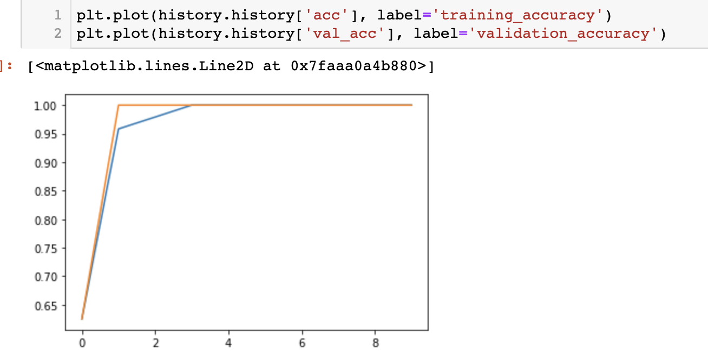
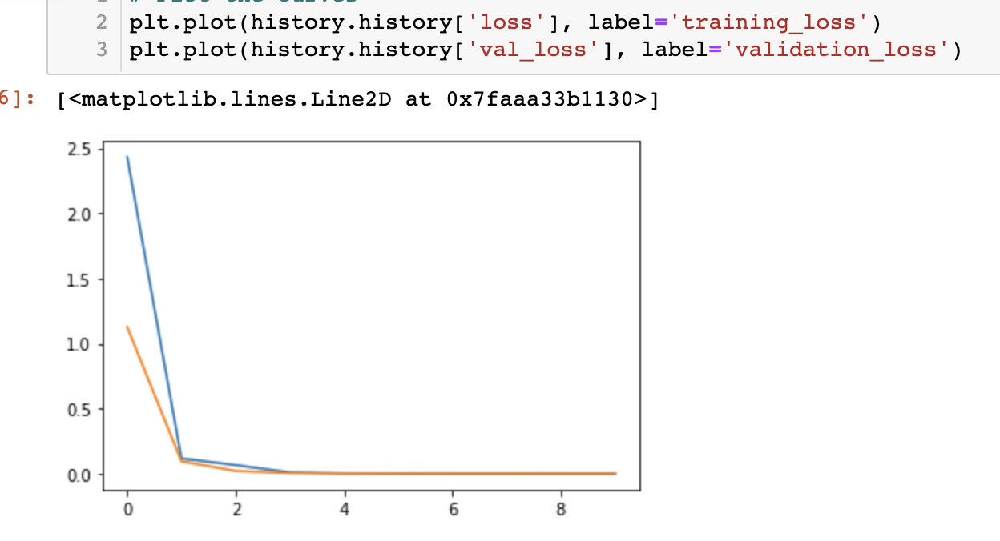

# Deep Learning on mint and basil leafs
Using VGG-16, a pre-trained CNN (Convolutional Neural Network) to recognise pictures of basil and mint leafs. 

## The methodology
I cropped the top layers of the VGG-16 model and froze them, then expanded the model with one Flattened layer and two Dense layers, experimenting with the activation functions. 

## The Data
I wanted to see if I can train a CNN to recognise the difference in mint and basil leafs, which are, in my opinion, not so different from each other. 
I bought a basil and a mint plant, took more than 200 pictures pictures of the leafs in many different positions, thus creating my own data set. 

## Usage
- Create a virtual environment with python 3.8 (optional): `conda create -n py38 python=3.8`
- Activate the virtual environment (optional): `conda activate py38`
- clone the repository 
- `pip install -r requirements.txt`
- run the notebook 'Transfer_learning_mint_basil.ipynb'

## Results
#### Plots of the loss and accuracy of my model 

Already after the first epoch, my model is doing very well, and especially after the 3d epoch, I have a testing accuracy score of 100%. This seemed too good to be true, so I looked back at my data and spotted my mistake: can you see it too? 
